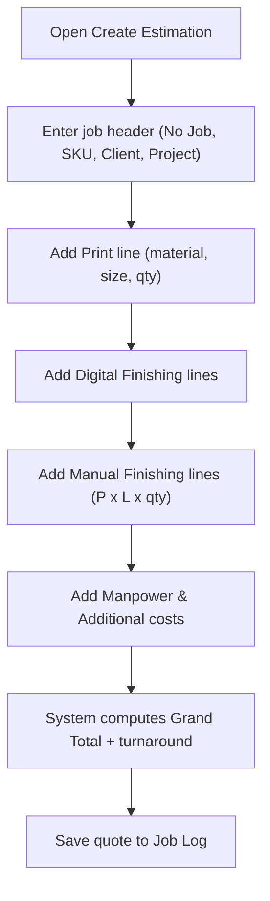

# BRD — RAB Calculator Web App (Print & Finishing Cost Estimator)

<aside>
📌

**Business Requirements Document (BRD)** — the *why* and *what* of the RAB Calculator from a business perspective. Pairs with the PRD (product) and SRS (technical).

</aside>

## 1. Document control

| Field | Value |
| --- | --- |
| Document | Business Requirements Document (BRD) |
| Product | RAB Calculator Web App (Print & Finishing Cost Estimator) |
| Version | 1.0 (Draft) |
| Owner | Product owner |
| Status | For review |

## 2. Executive summary

The business quotes **printing and finishing of packaging mockups**. Today, estimates (RAB — *Rencana Anggaran Biaya*) are produced in a manual spreadsheet that mixes the price list with live calculations, leading to errors, accidental overwrites, and no reliable quote history. The RAB Calculator web app standardizes pricing, automates the cost formulas, estimates turnaround, and stores every quote — reducing quoting time and pricing mistakes.

## 3. Business objectives

- **Accuracy:** eliminate manual calculation errors across all cost layers.
- **Speed:** generate a complete, correct estimate in under 2 minutes.
- **Governance:** keep a single, controlled master price list separate from calculations.
- **Flexibility:** let the owner change pricing and catalog items freely without rebuilding the tool.
- **Traceability:** maintain a searchable history of all quotes for review and reuse.

## 4. Background & current state

- Quoting relies on a shared spreadsheet (“Kalkulator RAB”) with separate tabs for reference data, calculation, a blank template, and a log.
- Prices and formulas sit beside live inputs, so a single bad edit silently changes future quotes.
- Manual finishing uses area-based formulas (P × L × rate × qty) that staff frequently miscalculate.
- Past quotes are not reliably retained or searchable.

## 5. Scope

### In scope

- A web app with a dedicated estimate-creation flow and a separate price-list/master-data manager.
- Four cost layers: printing, digital finishing, manual (area-based) finishing, manpower; plus operational add-ons.
- Automated grand total and turnaround estimate.
- Job log of all saved quotes.
- Full CRUD over every catalog item and category by the admin.
- User management: multiple users with role-based access (Admin, Estimator).

### Out of scope

- Invoicing, payments, taxes/accounting, and ERP functions.
- Production scheduling (turnaround is an estimate only).
- Customer-facing self-service quoting.

## 6. Stakeholders

| Stakeholder | Interest |
| --- | --- |
| **Admin / Owner** | Creates quotes, maintains the price list, and manages users. Full access. Multiple Admin users are allowed. |
| **Estimator (user)** | Creates and reviews quotes; views the job log. No access to price list or user management. |
| **Clients (indirect)** | Receive faster, more consistent quotes — do not use the system. |

## 7. Business requirements

| ID | Requirement | Priority |
| --- | --- | --- |
| BR-01 | Provide a dedicated menu to create a price estimate end to end. | Must |
| BR-02 | Provide a separate menu to manage catalog items per category (add / edit / remove). | Must |
| BR-03 | Automatically calculate print, digital finishing, manual finishing, manpower, and additional costs. | Must |
| BR-04 | Compute a grand total and an estimated turnaround time. | Must |
| BR-05 | Save every finalized quote to a searchable job log. | Must |
| BR-06 | Allow the admin to add or rename categories and fields without code changes. | Must |
| BR-07 | Keep the price list as the single source of truth, separate from calculations. | Must |
| BR-08 | Display all currency in Indonesian Rupiah with thousands separators. | Should |
| BR-09 | Allow reuse of a past quote as the basis for a new one via Duplicate to New Draft. | Must |
| BR-10 | Provide user management: add / edit / deactivate users and assign roles (Admin, Estimator). | Must |

## 8. Business process — quote creation

## 9. Assumptions & constraints

- Multiple users with role-based access (Admin, Estimator), managed via Firebase Authentication. Multiple Admin users are allowed.
- All rates and items are maintained by Admin users; the app ships with current defaults.
- Pricing is in IDR; one branch / one price list in v1.
- Turnaround excludes FA mockup file prep and machine/file trouble.

## 10. Success metrics

- Average time to produce a quote reduced to **< 2 minutes**.
- **Zero** calculation errors traced to manual math.
- **100%** of finalized quotes captured in the job log.
- Price-list updates made directly by the admin with **no developer involvement**.

## 11. Risks

| Risk | Mitigation |
| --- | --- |
| Incorrect price-list entry propagates to quotes | Record a full price-list audit log; show last-edited info. |
| Unauthorized access to pricing or quotes | Role-based access via Firebase Auth; regular data backups/export. |
| Formula complexity for manual finishing | Encapsulate formulas in the app; validate inputs. |

## 12. Technology stack

- **Frontend:** React (single-page web app).
- **Database:** Firebase Firestore (cloud NoSQL).
- **Authentication & user management:** Firebase Authentication with roles.
- **Hosting:** Firebase Hosting.