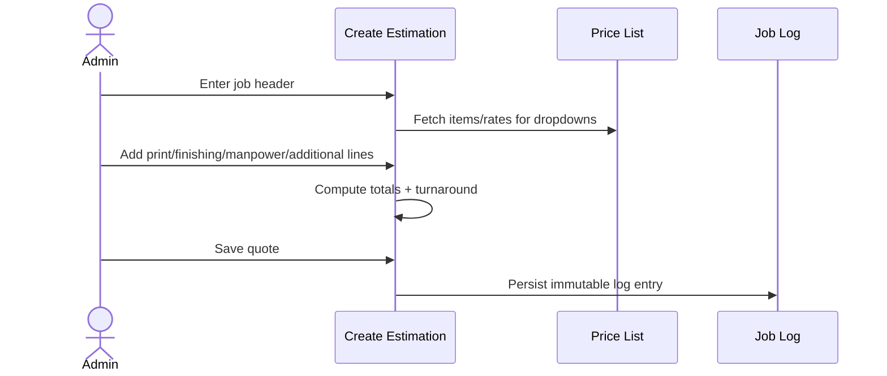

# SRS — RAB Calculator Web App (Print & Finishing Cost Estimator)

<aside>
⚙️

**Software Requirements Specification (SRS)** — the detailed functional and non-functional specification for the RAB Calculator. Pairs with the PRD (product) and BRD (business).

</aside>

## 1. Introduction

### 1.1 Purpose

This SRS defines the functional and non-functional requirements for the RAB Calculator web app: an internal tool that estimates the cost (RAB) of printing and finishing packaging mockups.

### 1.2 Scope

The system provides (a) a **Create Estimation** flow, (b) a **Price List / Master Data** manager with full CRUD per category, (c) a **Job Log** of saved quotes, and (d) **User Management**. It supports multiple users with role-based access (Admin, Estimator), is IDR-only, internal, and excludes invoicing/accounting/ERP.

### 1.3 Definitions & abbreviations

| Term | Meaning |
| --- | --- |
| RAB | Rencana Anggaran Biaya — cost/budget estimate |
| A3 / B2 | Print sizes: A3 = 29.7×42 cm, B2 = 50×70 cm |
| P × L | Panjang × Lebar (length × width), in cm |
| Qty | Quantity of units |
| CRUD | Create, Read, Update, Delete |

### 1.4 References

Product Requirements Document (PRD) and Business Requirements Document (BRD) for the same product.

## 2. Overall description

### 2.1 Product perspective

A standalone web application built with **React** and **Firebase Firestore**, with a price-list data store, a calculation engine, a quote log, and user management via **Firebase Authentication**. The price list is the single source of truth; calculator dropdowns and rates derive from it.

### 2.2 Product functions (summary)

- Manage catalog items and categories (CRUD).
- Build a multi-layer cost estimate.
- Compute totals and turnaround automatically.
- Persist and browse saved quotes.

### 2.3 User characteristics

Multiple users familiar with the print/finishing domain, in two roles: **Admin** (full access incl. price list and user management) and **Estimator** (create quotes, view job log). Multiple Admin users are allowed.

### 2.4 Constraints

- Currency: IDR only, integer Rupiah with thousands separators.
- Single price list / single branch in v1.
- Turnaround excludes file prep and machine/file trouble.

### 2.5 Assumptions & dependencies

- Users authenticate via Firebase Authentication; roles control access.
- Default catalog data is seeded at launch and fully editable thereafter.

## 3. System features (functional requirements)

### 3.1 Price List / Master Data management

- **FR-1.1** The system shall let the admin add, edit, and delete items in each category.
- **FR-1.2** Editable fields shall adapt per category (name, A3 price, B2 price, tooling rate, labor rate, minimum charge, daily rate, turnaround days, A3-only flag).
- **FR-1.3** The system shall let Admin users add or rename categories and define new fields (e.g. sizes beyond A3/B2). In v1, admin-created custom categories and fields are display/storage-only master data unless mapped to one of the built-in calculation layers.
- **FR-1.4** Changes to the price list shall immediately update dropdowns and rates used in Create Estimation.
- **FR-1.5** The system shall record last-edited metadata for price-list items.
- **FR-1.6** The system shall record a full audit log for price-list changes, including item id, changed fields, previous values, new values, edited by, and edited at.

### 3.2 Create Estimation — Job header

- **FR-2.1** The system shall capture No Job, SKU, Nama Klien, Judul Project, and creation date.

### 3.3 Print Calculator

- **FR-3.1** Supports multiple line items with inputs: material (Jenis Print), size (A3/B2), Qty.
- **FR-3.2** `Print line total = printUnitPrice[material][size] × Qty`; **Total Print** = sum of all print lines.
- **FR-3.3** The system shall prevent selecting a size with no price (N/A) for the chosen material.

### 3.4 Digital Finishing Calculator

- **FR-4.1** Supports multiple line items: finishing type, size, Qty.
- **FR-4.2** `Line total = digitalUnitPrice[type][size] × Qty`; **Total Finishing Digital** = sum of lines.
- **FR-4.3** The system shall enforce A3-only constraints (flag/block B2 where N/A).

### 3.5 Manual Finishing (area-based) Calculator

- **FR-5.1** Inputs per line: finishing type, P (cm), L (cm), Qty, Jml Alat (tool count). Jml Alat defaults to 1 and may be 0 for manual finishing types with no tooling component.
- **FR-5.2** `toolingCost = P × L × toolingRate[type] × jmlAlat`; if no tooling rate exists, toolingCost = 0.
- **FR-5.3** `laborCost = P × L × laborRate[type] × Qty`.
- **FR-5.4** `Line total = max(minimumCharge[type], toolingCost + laborCost)` when numeric minimum exists.
- **FR-5.5** For items whose minimum is **by request**, the system shall require a manual quoted amount before the quote can be saved; line total = manual quoted amount.
- **FR-5.6** **Total Finishing Manual** = sum of lines.

### 3.6 Manpower

- **FR-6.1** Inputs per line: name, days (Jumlah Hari), rate.
- **FR-6.2** `Line total = days × rate`; **Total Biaya Manpower** = sum of lines (default rate Rp 275,000/day, editable).

### 3.7 Additional / Operational costs

- **FR-7.1** Toggleable rows (Ya/Tidak) with note and value fields: Rush Job, Over Time, In-house Finishing, Metalize Material (Rp 5/cm), Paper Purchase (Rp 5,000/sheet), Product Purchase, Operator Fee, Mockup Operations.
- **FR-7.2** Additional cost rows support two input modes: direct manual amount, or quantity × master rate where a default rate exists. Admin users can configure which mode each row uses.
- **FR-7.3** **Total Biaya Tambahan** = sum of enabled rows.

### 3.8 Totals & turnaround

- **FR-8.1** `Grand Total = Total Print + Total Finishing Digital + Total Finishing Manual + Total Manpower + Total Tambahan`.
- **FR-8.2** The system shall compute estimated turnaround as the maximum turnaround days among selected print, finishing, manpower, and additional-cost components.

### 3.9 Job Log

- **FR-9.1** On save, the system shall persist the full quote detail: job header, line items, input snapshots, price snapshots, computed totals, grand total, turnaround, and created-by user.
- **FR-9.2** On save, the system shall persist log summary fields: Date, No Job, SKU, Client, Project, Total Print, Total Finishing, Total Manpower, Total Tambahan, Grand Total.
- **FR-9.3** The log shall be searchable/filterable by date range, No Job, SKU, client, project, created-by user, and grand-total range.
- **FR-9.4** Saved quotes shall be immutable; corrections create a new entry.
- **FR-9.5** The system shall support **Duplicate to New Draft** from a saved quote; duplication creates an editable draft with a new quote id and date while preserving the original immutable quote.

### 3.10 User Management

- **FR-10.1** The system shall let Admin users add, edit, and deactivate users. In-app deletion is implemented as deactivation to preserve quote history.
- **FR-10.2** Each user shall have a role: **Admin** or **Estimator**.
- **FR-10.3** Multiple Admin users are allowed.
- **FR-10.4** Access to Price List / Master Data and User Management shall be restricted to Admin users.
- **FR-10.5** All users shall authenticate before accessing the system.
- **FR-10.6** Self-registration shall be disabled; Admin users create accounts. The first Admin account is seeded during project setup.

## 4. External interface requirements

### 4.1 User interface

- Primary navigation areas: **Create Estimation**, **Price List / Master Data**, **Job Log**, and **User Management** (Admin only).
- Dropdowns are populated from the master list; rates are never typed manually during estimation.
- All monetary values displayed in IDR with thousands separators.

### 4.2 Software interfaces

- React single-page web app; **Firebase Firestore** as the persistent data store for catalog, quotes, log, and users.
- **Firebase Authentication** for login/session and roles; **Firebase Hosting** for deployment.
- CSV export of price list and job log for backup is included in v1. PDF quote export is a future enhancement.

### 4.3 Hardware interfaces

- Standard desktop/laptop browser; no specialized hardware.

## 5. Non-functional requirements

| ID | Category | Requirement |
| --- | --- | --- |
| NFR-1 | Performance | Totals recompute instantly (< 200 ms) as inputs change. |
| NFR-2 | Usability | A complete quote can be produced in under 2 minutes. |
| NFR-3 | Reliability | Saved quotes are durable and immutable; data backed up/exportable. |
| NFR-4 | Security | Role-based access via Firebase Authentication; price list and user management restricted to Admins. |
| NFR-5 | Flexibility | All catalog items, rates, and categories are CRUD-editable without code changes. |
| NFR-6 | Data integrity | Validate inputs (Qty > 0, valid size/material combos) before calculating. |
| NFR-7 | Localization | IDR currency formatting; Indonesian domain terminology preserved. |

## 6. Data requirements

### 6.1 Core entities

| Entity | Key fields |
| --- | --- |
| Category | id, name, field schema |
| PriceItem | id, categoryId, name, A3 price, B2 price, tooling rate, labor rate, minimum charge, minimum type (numeric/by request), daily rate, turnaround days, A3-only flag, additional cost mode (manual/rate), lastEdited |
| PriceAuditEntry | id, itemId, categoryId, changedFields, previousValues, newValues, editedBy, editedAt |
| Quote | id, No Job, SKU, client, project, date, line items, price snapshots, totals, grand total, turnaround, createdBy, sourceQuoteId (when duplicated) |
| QuoteLineItem | id, quoteId, layer (print/digital/manual/manpower/additional), inputs, priceSnapshot, computed total |
| LogEntry | date, No Job, SKU, client, project, createdBy, total print, total finishing, total manpower, total additional, grand total |
| User | id, name, email, role (Admin/Estimator), status (active/inactive), createdAt |

### 6.2 Calculation engine (reference)

```
Print line total     = printUnitPrice[material][size] × qty
Total Print          = ΣPrintLines
Digital line total   = digitalUnitPrice[type][size] × qty
Manual formula total = toolingCost + laborCost
Manual line total    = manualQuotedAmount when minimum is by request; otherwise max(minimumCharge[type], Manual formula total)
  toolingCost        = P × L × toolingRate[type] × jmlAlat (0 when no tooling rate)
  laborCost          = P × L × laborRate[type] × qty
Manpower line total  = days × dailyRate
Additional line total = manual amount OR quantity × master rate
Grand Total          = ΣPrint + ΣDigital + ΣManual + ΣManpower + ΣAdditional
```

## 7. Use case — create and save a quote



## 8. Technology stack

- **Frontend:** React single-page app, component-based UI.
- **Database:** Firebase Firestore — collections for `categories`, `priceItems`, `quotes`, `logEntries`, `users`.
- **Authentication:** Firebase Authentication (email/password) with role claims (Admin, Estimator).
- **Hosting:** Firebase Hosting.
- **Architecture:** client-side calculation engine; Firestore security rules enforce role-based access.